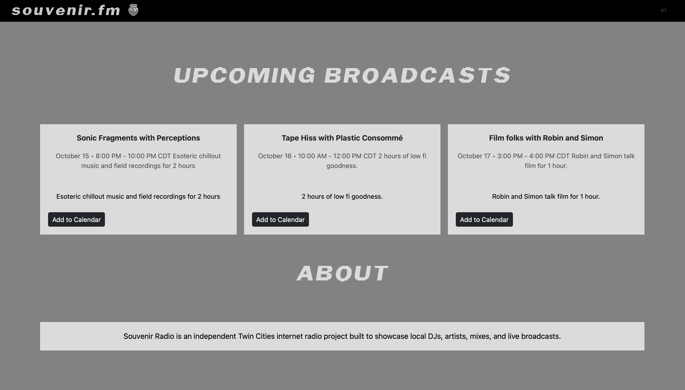

### Live Broadcast 

### Archived Broadcast

### Schedule

# Souvenir Radio

Souvenir Radio is a web based internet radio project focused on showcasing DJs, artists, mixes, and live broadcasts
from the Twin Cities music community

The project combines frontend with an AzuraCast streaming Backend. Listeners can play the station from the website,
view information about the currently playing archived mix or live DJ and see any upcoming broadcasts.

## Features

* Continous internet radio playback via AzuraCast
* Detection for live and archived broadcasts
* Now-playing metadata that is dynamic
* DJ & show info for broadcasts
* Dynamic broadcast schedule
* Downloadable schedule 

## Architecture

Souvenir Radio Web Frontend 
```
                 ┌─────────────────────┐
                 │   Souvenir Radio    │
                 │    Web Frontend     │
                 │                     │
                 │ HTML / CSS / JS     │
                 │       Vite          │
                 └──────────┬──────────┘
                            │
                            │ HTTP / JSON
                            ▼
                 ┌─────────────────────┐
                 │     AzuraCast       │
                 │                     │
                 │ Now Playing API     │
                 │ Audio Streaming     │
                 │ Live DJ Metadata    │
                 └──────────┬──────────┘
                            │
                 ┌──────────┴──────────┐
                 │                     │
                 ▼                     ▼
          Archived Mixes          Live Broadcast
           Liquidsoap               DJ / BUTT

```
AzuraCast handles the station & stream infrastructure

When there isnt a live broadcast coming in via BUTT -> Azuracast, an archived mix
is played from an automated program on AzuraCast (Liquid Soap Dj)
When a DJ connects to the Azuracast live source, the frontend detects
the live broadcast through the Now Playing Api and updated the frontend.

## How Now Playing Works

The frontend periodically requests AzuraCast's static Now Playing endpoint:

/api/nowplaying_static/{station_shortcode}.json

The application refreshes this data every 15 seconds.

For archived broadcasts, Souvenir Radio reads metadata from:

now_playing.song.artist
now_playing.song.title
now_playing.song.lyrics
now_playing.song.art

These values are used to display the DJ or artist name, mix title, description, and artwork.

For live broadcasts, the application checks:

live.is_live

When the station is live, live.streamer_name is used to identify the DJ. Additional show information is loaded from liveDjs.json.

A live DJ entry has the following structure:
````
{
"dj-name": {
"showTitle": "Example Show",
"description": "Description of the DJ and radio show."
}
}
````
Live artwork is provided by AzuraCast through the live broadcast metadata.

## Upcoming Broadcasts

Upcoming programs are read from:

souvenir-schedule.json

Each schedule entry can contain:

````
  { "title": "Example Show",
  "host": "DJ Name",
  "description": "Description of the broadcast.",
  "image_url": "https://example.com/image.jpg",
  "start_time": "2026-10-10T19:00:00-05:00",
  "end_time": "2026-10-10T21:00:00-05:00"
}
````

The frontend filters out past broadcasts, sorts future broadcasts chronologically, and displays the next three scheduled shows.


## Technology


| Technology    | Purpose                                        |   
|---------------|------------------------------------------------|
| JavaScript    | Frontend application logic and API integration |  
| HTML          | Page structure and audio player                | 
| CSS           | Custom Styling                                 | 
| Vite          | Local dev & production build tooling           |
| Bootstrap     | Layout and utility classes                     |
| AzuraCast     | Internet radio management and streaming        |
| BUTT          | Live DJ audio source connection                |
| Digital Ocean | Cloud infrastrucutre hosting AzuraCast         |

### Local Development
#### Prerequisites

Install Node.js and npm.

Check your installation with:

```
node --version
npm --version
```

Clone the repository

```
git clone https://github.com/nickgandrud/souvenir-radio.git
cd souvenir-radio
```
Install dependencies
```
npm install
```
Configure the application

Create a .env.local file in the project root:
```
VITE_AZURACAST_BASE=https://your-azuracast-server
VITE_STATION_SHORTCODE=your_station_shortcode
VITE_STREAM_URL=https://your-stream-url
```
These values configure the frontend's connection to the AzuraCast instance.

Vite environment variables prefixed with VITE_ are exposed to the browser and should not contain passwords, API keys, or other secrets.

Start the development server
```
npm run dev
```

Vite will provide a local development URL, typically:

```
http://localhost:5173
```

Project Structure
```
souvenir-radio/
├── index.html
├── app.js
├── styles.css
├── liveDjs.json
├── souvenir-schedule.json
├── package.json
├── package-lock.json
├── fonts/
└── assets/
```

index.html contains the application layout and audio element.

app.js handles AzuraCast communication, player controls, live-DJ detection, metadata updates, and upcoming broadcasts.

styles.css contains the responsive design and player styling.

liveDjs.json stores additional metadata for live DJs and radio programs.

souvenir-schedule.json stores upcoming broadcast information.

### Player Flow

When the application starts, it loads the live-DJ configuration and upcoming broadcast schedule.

It then requests current station information from AzuraCast and determines whether the station is playing an archived broadcast or receiving a live DJ stream.

The appropriate title, description, artwork, and LIVE indicator are rendered in the player.

Clicking the artwork starts or pauses the station's audio stream.

The Now Playing data is refreshed every 15 seconds so the page can update automatically when the station changes from archived programming to a live broadcast or when the currently playing mix changes.

### Project Goals

Souvenir Radio began as a way to explore the technical infrastructure behind independently operated internet radio while building a platform that could eventually support the Twin Cities music community.

The project has involved work across frontend development, API integration, cloud infrastructure, streaming audio, metadata management, live broadcasting, and responsive web design.

Future development may include expanded scheduling tools, improved DJ management, production deployment of the public site, and additional station-management automation.

### Status

Souvenir Radio is currently private project rather than a public production service at the moment.

Core functionality implemented includes:

Hosted AzuraCast radio infrastructure

Automated archived programming

Live DJ broadcasting

Multiple streamer accounts

Dynamic live/archive UI states

AzuraCast API integration

Upcoming show scheduling

Responsive radio player UI

### Known Deployment Limitation

The current development AzuraCast instance is accessed directly through its server rather than through a production hostname.

Following an AzuraCast container update, the instance regenerated its default self-signed TLS certificate. Modern browsers reject this certificate for normal cross-origin API requests because it is not issued for the server's public address.

As a result, local browser development may require manually trusting the development certificate.

A future production deployment would use a dedicated hostname and trusted TLS certificate before the service is publicly launched.

This limitation affects the deployment environment rather than the underlying streaming, scheduling, or metadata functionality.

### What I Learned

This project provided hands-on experience working across application development and infrastructure, including:

Integrating a frontend application with a third-party REST API

Working with asynchronous JavaScript and periodically refreshed data

Designing UI behavior around live application state

Hosting containerized services on DigitalOcean

Configuring AzuraCast and Liquidsoap

Creating and managing authenticated live streaming accounts

Broadcasting audio with BUTT and Icecast

Troubleshooting Docker container updates

Diagnosing HTTPS/TLS certificate failures

Debugging cross-origin browser behavior

Separating frontend application configuration from radio infrastructure

### Future Improvements

Potential future work includes:

Production deployment at souvenir.fm

Dedicated hostname for the AzuraCast service

Trusted HTTPS/TLS configuration

Expanded live DJ management

Automated schedule synchronization

Improved error handling for unavailable streams

Additional mobile UI improvements

Public launch for Twin Cities DJs and artists